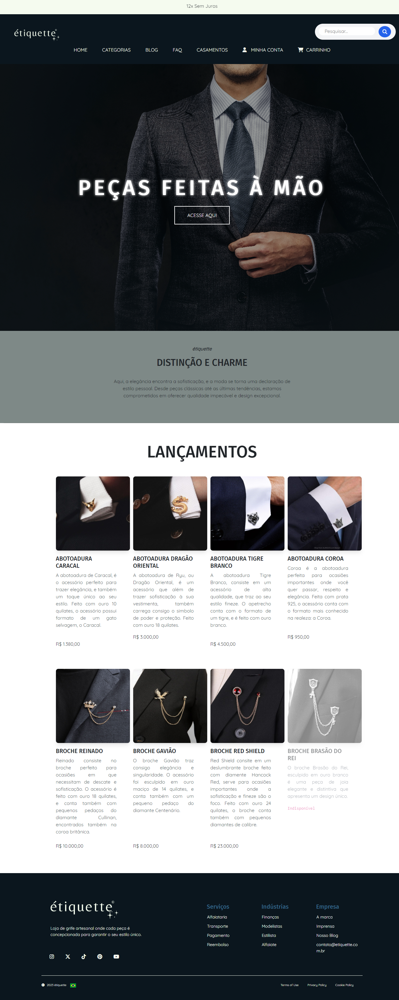
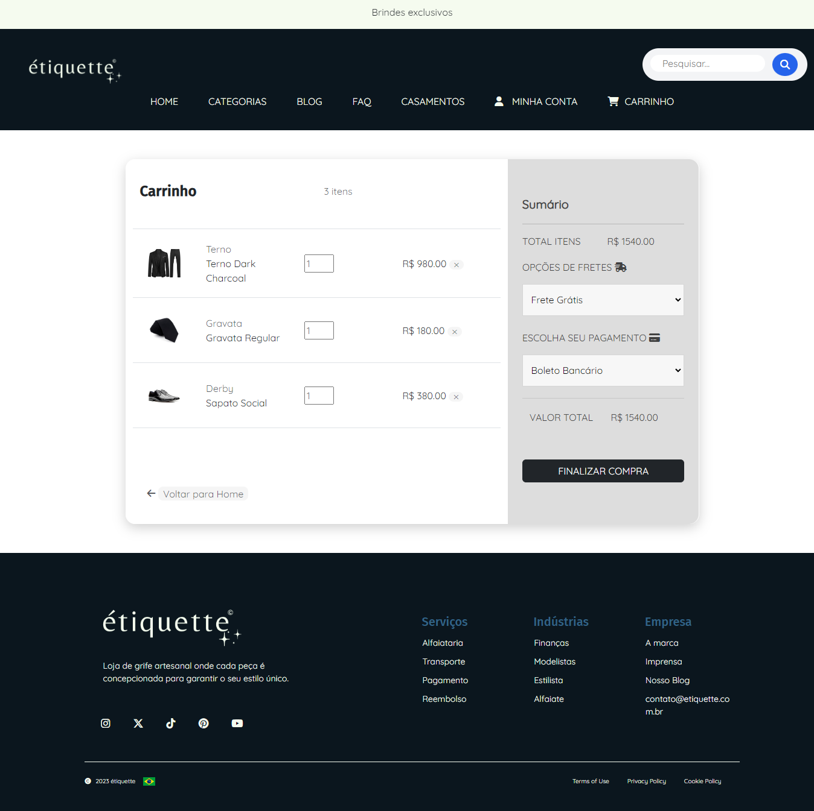
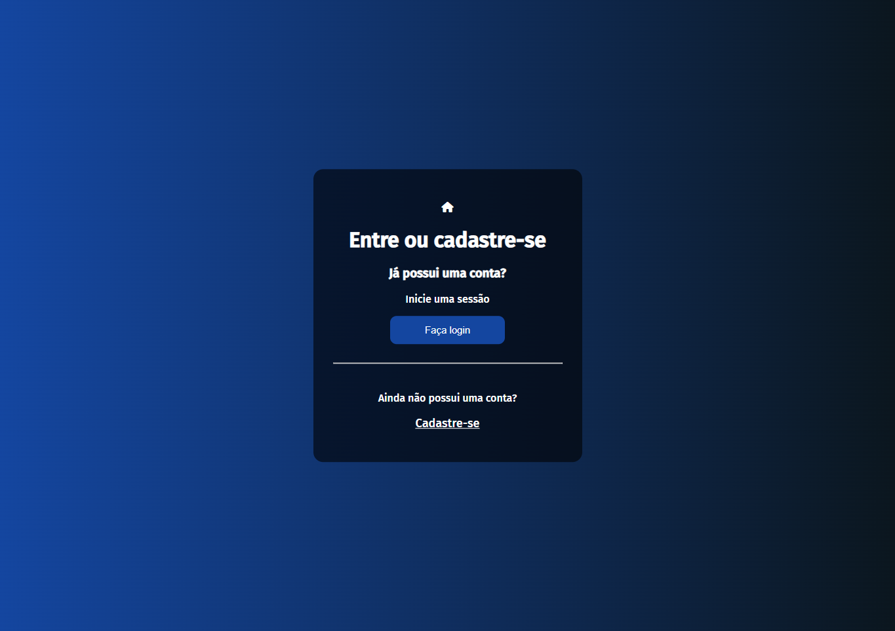

<!-- # Projeto TCC Curso Técnico — Loja de Grife Masculina -->

# Étiquette: uma loja de grife masculina.

<h3>Home Page</h3>

> Welcome to <i>étiquette</i>! Uma loja de grife masculina com produtos importados da frança, com estilos elegantes para a moda masculina. Abaixo irei te mostrar o design de partes do nosso site.

 

<h3>For my wedding</h3>

 

<h3>Cart</h3>

 

<h3>Cadastro</h3>

 

<h3>My account</h3>

 

Para mais informações das imagens/prints do site, acesse pelo repositório: <code>Documentos/prints</code>

 

## 📝 Licença

Esse projeto está sob licença de <strong>Bianca Moraes</strong>.

 

   
   
   
   
   
   
   

